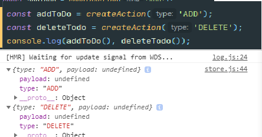
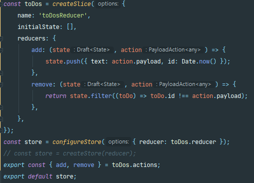

### Redux (Vanilla & React)

# Vanilla_Redux
### store
- data 넣는 장소 (state)
- creatStore => yarn add redux
### store 생성 
  
- 항상 reducer라는 함수를 생성후 createStore 안에 넣음

### dispatch
  
- message를 전송하는 방법으로 사용된다  

# React_Redux

### connect()
  
- props에 추가될 수 있도록 허용(위 사진을 적용시킬시 props에 컴포넌트가 한개 추가)

# yarn add @reduxjs/toolkit
  
- toolkit을 사용한 createAction을 사용시 이렇게 찍힌다(payload에 찍히는걸 확인 가능) 
### createReducer
- 사용시 switch,case 문을 사용 안해도됨
  
- state를 변경시킴(push는 mutate를 해준다, filter는 안해줌(그래서 return을 사용해야함))
### configureStore
- const store = configureStore({ reducer }); (사용시 Redux Developer Tools 사용가능)(Redux toolkit를 사용하지않아도 configureStore 사용시 가능)
### createSlice
- reducer 와 action 생성을 해준다. 
  
