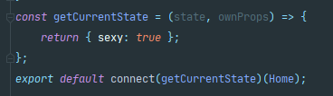

### Redux (Vanilla & React)

# Vanilla_Redux
### store
- data 넣는 장소 (state)
- creatStore => yarn add redux
### store 생성 
  
- 항상 reducer라는 함수를 생성후 createStore 안에 넣음

### dispatch
  
- message를 전송하는 방법으로 사용된다  

# React_Redux

### connect()
  
- props에 추가될 수 있도록 허용(위 사진을 적용시킬시 props에 컴포넌트가 한개 추가)
